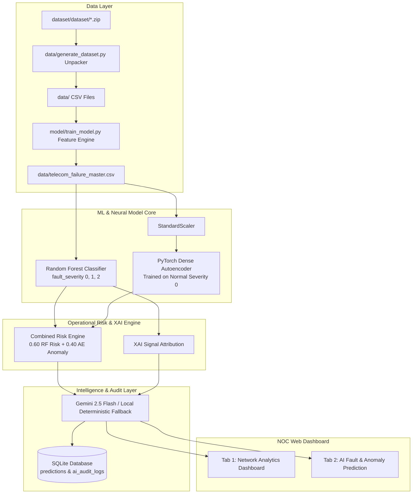

# Telecom Network Fault Prediction and Predictive Maintenance System

[](https://www.python.org/)
[](https://pytorch.org/)
[](https://streamlit.io/)
[](https://opensource.org/licenses/MIT)

An AI-powered academic web application and machine learning framework designed for Network Operations Centers (NOC). The system analyzes real telecom network event logs from the **Telstra Recruiting Network Disruptions Dataset**, predicts fault severity risk, detects statistical telemetry anomalies using PyTorch Autoencoders, fuses predictions into a single operational risk score, provides XAI feature attributions, generates evidence-grounded root-cause hypotheses, and recommends preventive maintenance actions for network engineers.

---

## 📌 Problem Statement

Modern telecommunication networks generate massive volumes of event tickets, alarm logs, and resource alerts. NOC engineers face significant challenges in triaging tickets, identifying severe fault risks before full service outages occur, and diagnosing underlying root causes. 

This project addresses these challenges by developing a dual-model predictive architecture:
1. **Supervised ML Fault Severity Prediction**: Classifies incoming event tickets into `0 (Low/No Fault)`, `1 (Medium Fault)`, or `2 (Severe Fault)`.
2. **Unsupervised PyTorch Autoencoder Anomaly Detection**: Learns normal network telemetry patterns from severity `0` records and flags uncharacteristic event/log spikes based on reconstruction error (MSE).
3. **Combined Operational Risk Score & AI NOC Copilot**: Merges ML classifier risk and Autoencoder anomaly scores into a unified operational risk index, accompanied by XAI signal attribution and Gemini GenAI / Local Deterministic fallback assistance.

---

## 📂 Real Dataset Structure & Column Mapping

The system is configured to directly process the real **Telstra Recruiting Network Dataset** provided in `dataset/dataset/*.zip`:

### 1. Dataset Location
- Uploaded Archive: `dataset/dataset/` containing `train.csv.zip`, `test.csv.zip`, `event_type.csv.zip`, `resource_type.csv.zip`, `severity_type.csv.zip`, `log_feature.csv.zip`.
- Extracted Data Directory: `data/`

### 2. Schema Inspection & Column Mappings

| Original CSV File | Rows | Columns | Concept Mapped | Data Type | Key Relationships |
| :--- | :--- | :--- | :--- | :--- | :--- |
| `train.csv` | 7,381 | `id`, `location`, `fault_severity` | Ticket ID, Site Location, Fault Target (`0`, `1`, `2`) | `id`: int64, `location`: str, `fault_severity`: int64 | Primary training set (7,381 unique tickets) |
| `test.csv` | 11,171 | `id`, `location` | Unlabeled Test Ticket IDs & Site Locations | `id`: int64, `location`: str | Unlabeled test tickets (11,171 unique tickets) |
| `event_type.csv` | 31,170 | `id`, `event_type` | Event / Alarm Type Categorical Features | `id`: int64, `event_type`: str | One-to-many relationship (crosstab presence count) |
| `resource_type.csv` | 21,076 | `id`, `resource_type` | Resource / Device Type Categorical Features | `id`: int64, `resource_type`: str | One-to-many relationship (crosstab presence count) |
| `severity_type.csv` | 18,552 | `id`, `severity_type` | Severity / Alarm Level Categorical Features | `id`: int64, `severity_type`: str | One-to-one relationship (18,552 tickets) |
| `log_feature.csv` | 58,671 | `id`, `log_feature`, `volume` | Log Features & Numeric Volume Counts | `id`: int64, `log_feature`: str, `volume`: int64 | One-to-many relationship (pivot table with volume sum) |

---

## 🏗️ System Architecture



---

## ⚙️ Setup & Execution Instructions

### 1. Prerequisites
- Python 3.10 or higher
- Git

### 2. Install Dependencies
```bash
pip install -r requirements.txt
```

### 3. Environment Configuration (Optional Gemini GenAI)
Copy `.env.example` to `.env`:
```bash
cp .env.example .env
```
Set your Google Gemini API key:
```env
GEMINI_API_KEY=your_actual_gemini_api_key_here
```
*Note: If no API key is set, the application operates 100% offline using local deterministic rule-based analysis.*

### 4. Step-by-Step Training Commands

```bash
# 1. Unpack uploaded real dataset files into 'data/'
python data/generate_dataset.py

# 2. Preprocess real dataset features & train Supervised Random Forest Classifier
python model/train_model.py

# 3. Train PyTorch Autoencoder Anomaly Detector on real normal tickets
python model/train_autoencoder.py
```

### 5. Launch Application
Run using PowerShell, Batch scripts, or Streamlit CLI:
```bash
# Windows PowerShell
.\run_app.ps1

# Windows Batch
run_app.bat

# Direct Streamlit Command
streamlit run app/streamlit_app.py
```

---

## 🔬 Model Evaluation Metrics (Real Dataset)

### 1. Supervised Random Forest Classifier
- **Dataset Evaluated**: 7,381 real Telstra tickets (80% train / 20% stratified test split)
- **Input Dimensions**: 458 total engineered features
- **Metrics**:
  - **Accuracy**: `70.41%`
  - **Precision (Macro)**: `65.13%`
  - **Recall (Macro)**: `74.30%`
  - **F1-Score (Macro)**: `67.45%` (Weighted F1: `72.0%`)
- **Classification Breakdown**:
  - `0 (Low Fault)`: Precision `0.91`, Recall `0.68`, F1 `0.78`
  - `1 (Medium Fault)`: Precision `0.50`, Recall `0.73`, F1 `0.60`
  - `2 (Severe Fault)`: Precision `0.54`, Recall `0.82`, F1 `0.65`

### 2. PyTorch Unsupervised Autoencoder Anomaly Detection
- **Architecture**: `Input (455) -> Dense(227) -> Dense(113) -> Bottleneck(16) -> Dense(113) -> Dense(227) -> Output (455)`
- **Training Strategy**: Trained exclusively on real normal tickets (`fault_severity == 0`, 4,784 samples).
- **Anomaly Threshold**: **95th Percentile** normal validation reconstruction MSE (`1.4704`).
- **Evaluation Metrics** (vs `fault_severity >= 1`):
  - **ROC-AUC Score**: `0.6241`
  - **Precision-Recall AUC**: `0.4741`
  - **Anomalous Rate (MSE > Threshold)**: `5.74%`

### 3. Combined Risk Score Fusion Formula
$$\text{Combined Risk} = 0.60 \times P(\text{fault\_severity} \ge 1) + 0.40 \times \min\left(1.0, \frac{\text{MSE}}{\text{Threshold}}\right)$$

- **Risk Categories**:
  - 🟢 `LOW`: Normal pattern & low fault risk (< 0.35)
  - 🟡 `ELEVATED`: Low known fault risk, abnormal telemetry (0.35 - 0.55)
  - 🟠 `HIGH`: High fault risk profile (> 0.55)
  - 🔴 `CRITICAL`: High fault risk AND high anomaly score (>= 0.70)

---

## ⚠️ Key Assumptions, Limitations & NOC Disclaimers

> [!WARNING]
> **Operational Assumptions & Constraints**:
> 1. **Data Granularity**: The Kaggle Telstra dataset contains event ticket records aggregated by ID, rather than real-time continuous sensor telemetry.
> 2. **No Time-Series Timestamp**: The base Kaggle dataset lacks timestamped time series metadata. Therefore, the system assesses **fault severity risk and telemetry anomaly status**, but does NOT claim guaranteed future outage forecasting.
> 3. **Hypothesis vs Diagnosis**: Root-cause diagnostic outputs are probable statistical hypotheses based on observed event/log presence, requiring validation by human NOC engineers.
> 4. **No Automated Remediation**: Recommendations provide decision support only and do NOT automatically perform physical network remediation.
